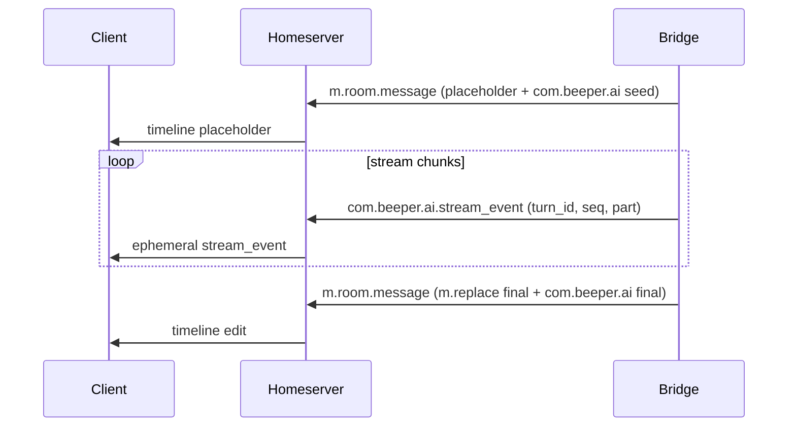

# Matrix AI Transport Spec v1

> Status: *Unreleased*, proposed v1.
>
> This is a highly experimental profile.
> It requires homeserver and client support (custom event types + ephemeral events + rendering/consumption).
> Beeper is building experimental support for this profile, and it might never get a public release.

## Contents
- [Scope](#scope)
- [Compatibility](#compatibility)
- [Terminology](#terminology)
- [Inventory](#inventory)
- [Canonical Assistant Message](#canonical)
- [Streaming](#streaming)
- [Timeline Projections](#projections)
- [State Events](#state)
- [Tool Approvals](#approvals)
- [Other Matrix Keys](#other-keys)
- [Defined Schemas (May Not Be Emitted)](#defined-schemas)
- [Implementation Notes](#impl-notes)
- [Forward Compatibility](#forward-compat)

<a id="scope"></a>
## Scope
This document specifies the Matrix transport surface used by this bridge:
- Canonical assistant content in `m.room.message` (`com.beeper.ai` as AI SDK-compatible `UIMessage`).
- Streaming deltas as ephemeral events (`com.beeper.ai.stream_event` with AI SDK `UIMessageChunk`).
- `com.beeper.ai.*` timeline projection events (tool call/result, compaction status, etc).
- `com.beeper.ai.*` state events (room settings/capabilities).
- Tool approvals (MCP approvals + selected builtin tools).
- Auxiliary `com.beeper.ai*` keys used for routing/metadata.

Upstream reference (AI SDK):
- Vercel AI SDK inspected at commit `ff7dd528f3933f67bf4568126db0a81cd4a47a96` (2026-02-06 UTC).
- Core types:
  - `packages/ai/src/ui/ui-messages.ts`
  - `packages/ai/src/ui-message-stream/ui-message-chunks.ts`
  - `packages/ai/src/ui-message-stream/json-to-sse-transform-stream.ts`

Source of truth in this repo:
- Event type identifiers: `pkg/matrixevents/matrixevents.go`
- Event payload structs (where defined): `pkg/connector/events.go`
- Streaming envelope and emission: `pkg/matrixevents/matrixevents.go`, `pkg/connector/stream_events.go`
- Tool call/result projections: `pkg/connector/tool_execution.go`
- Compaction status emission: `pkg/connector/response_retry.go`
- State broadcast: `pkg/connector/chat.go`
- Approvals: `pkg/connector/tool_approvals*.go`, `pkg/connector/handlematrix.go`, `pkg/connector/inbound_command_handlers.go`, `pkg/connector/streaming.go`

<a id="compatibility"></a>
## Compatibility
- Homeserver support for custom event types and ephemeral events is required.
- Clients must explicitly implement rendering/consumption of these custom types.
- Non-supporting clients should fall back to `m.room.message.body` where available.

<a id="terminology"></a>
## Terminology
- `turn_id`: Unique ID for a single assistant response "turn".
- `seq`: Per-turn monotonic sequence number for stream events.
- `target_event`: Matrix event ID that a stream relates to (typically the placeholder timeline event).
- `call_id` / `toolCallId`: Tool invocation identifier.
- "timeline": persisted Matrix events.
- "ephemeral": non-persisted events (dropped by servers/clients that don't support them).

<a id="inventory"></a>
## Inventory
Authoritative identifiers are defined in `pkg/matrixevents/matrixevents.go`.

### Event Types
| Event type | Class | Persistence | Primary purpose | Spec section |
| --- | --- | --- | --- | --- |
| `m.room.message` | message | timeline | Canonical assistant message carrier (`com.beeper.ai`) | [Canonical](#canonical) |
| `com.beeper.ai.stream_event` | ephemeral | ephemeral | Streaming `UIMessageChunk` deltas | [Streaming](#streaming) |
| `com.beeper.ai.tool_call` | message | timeline | Tool invocation projection | [Projections](#projection-tool-call) |
| `com.beeper.ai.tool_result` | message | timeline | Tool result projection | [Projections](#projection-tool-result) |
| `com.beeper.ai.compaction_status` | message | timeline | Context compaction lifecycle/status | [Projections](#projection-compaction) |
| `com.beeper.ai.room_capabilities` | state | state | Bridge-controlled capabilities and effective settings | [State](#state-room-capabilities) |
| `com.beeper.ai.room_settings` | state | state | User-editable room settings | [State](#state-room-settings) |
| `com.beeper.ai.model_capabilities` | state | state | Available models + capabilities (defined; may be unused) | [State](#state-model-capabilities) |
| `com.beeper.ai.agents` | state | state | Agents + orchestration (defined; may be unused) | [State](#state-agents) |
| `com.beeper.ai.stream_delta` | ephemeral | ephemeral | Legacy/compat streaming deltas (defined; may be unused) | [Defined schemas](#defined-schemas) |
| `com.beeper.ai.assistant_turn` | message | timeline | Rich turn container (defined; may be unused) | [Defined schemas](#defined-schemas) |
| `com.beeper.ai.error` | message | timeline | AI error event (defined; may be unused) | [Defined schemas](#defined-schemas) |
| `com.beeper.ai.turn_cancelled` | message | timeline | Turn cancelled event (defined; may be unused) | [Defined schemas](#defined-schemas) |
| `com.beeper.ai.agent_handoff` | message | timeline | Agent handoff event (defined; may be unused) | [Defined schemas](#defined-schemas) |
| `com.beeper.ai.step_boundary` | message | timeline | Step boundary event (defined; may be unused) | [Defined schemas](#defined-schemas) |
| `com.beeper.ai.generation_status` | message | timeline | Generation status event (defined; may be unused) | [Defined schemas](#defined-schemas) |
| `com.beeper.ai.tool_progress` | message | timeline | Tool progress event (defined; may be unused) | [Defined schemas](#defined-schemas) |

### Content Keys (Inside Standard Events)
| Key | Where it appears | Purpose | Spec section |
| --- | --- | --- | --- |
| `com.beeper.ai` | `m.room.message` | Canonical assistant `UIMessage` | [Canonical](#canonical) |
| `com.beeper.ai.tool_call` | `com.beeper.ai.tool_call` event content | Tool call payload | [Projections](#projection-tool-call) |
| `com.beeper.ai.tool_result` | `com.beeper.ai.tool_result` event content | Tool result payload | [Projections](#projection-tool-result) |
| `com.beeper.ai.approval_decision` | inbound `m.room.message` raw content | Approve/deny payload | [Approvals](#approvals-decision) |
| `com.beeper.ai.model_id` | `m.room.message` | Routing/display hint | [Other keys](#other-keys-routing) |
| `com.beeper.ai.agent` | `m.room.message`, `m.room.member` | Routing hint or agent definition | [Other keys](#other-keys-agent) |
| `com.beeper.ai.image_generation` | `m.room.message` (image) | Generated-image tag/metadata | [Other keys](#other-keys-media) |
| `com.beeper.ai.tts` | `m.room.message` (audio) | Generated-audio tag/metadata | [Other keys](#other-keys-media) |

<a id="canonical"></a>
## Canonical Assistant Message
Canonical assistant content is carried in a standard `m.room.message` event.

Requirements:
- MUST include standard Matrix fallback fields (`msgtype`, `body`) for non-AI clients.
- MUST include `com.beeper.ai` and it MUST be an AI SDK-compatible `UIMessage`.

### UIMessage Shape
`com.beeper.ai`:
- `id: string`
- `role: "assistant"`
- `metadata?: object`
- `parts: UIMessagePart[]`

Recommended `metadata` keys:
- `turn_id`, `agent_id`, `model`, `finish_reason`
- `usage` (`prompt_tokens`, `completion_tokens`, `reasoning_tokens`, `total_tokens?`)
- `timing` (`started_at`, `first_token_at`, `completed_at`, unix ms)

Example:
```json
{
  "msgtype": "m.text",
  "body": "Thinking...",
  "com.beeper.ai": {
    "id": "turn_123",
    "role": "assistant",
    "metadata": { "turn_id": "turn_123" },
    "parts": []
  }
}
```

<a id="streaming"></a>
## Streaming
Streaming uses ephemeral `com.beeper.ai.stream_event` events.

### Envelope
Event type: `com.beeper.ai.stream_event` (ephemeral)

Content:
- `turn_id: string` (REQUIRED)
- `seq: integer` (REQUIRED, starts at 1, strictly increasing per `turn_id`)
- `part: UIMessageChunk` (REQUIRED)
- `target_event?: string` (RECOMMENDED)
- `agent_id?: string` (OPTIONAL)
- `m.relates_to?: { rel_type: "m.reference", event_id: string }` (RECOMMENDED when `target_event` is present)

### SSE Mapping
AI SDK UI streams emit SSE frames:
- `data: <JSON UIMessageChunk>`
- terminal sentinel `data: [DONE]`

Mapping:
1. For each SSE JSON chunk, send one `com.beeper.ai.stream_event` with `part = <chunk>`.
2. `data: [DONE]` is transport-level termination and does not require a Matrix event.

Implications:
- Producers MUST NOT remap chunk payload schemas.
- Consumers MUST process `part` as AI SDK `UIMessageChunk`.

### Chunk Compatibility
Producers MAY emit any valid AI SDK `UIMessageChunk` type:
- `start`
- `start-step`
- `finish-step`
- `message-metadata`
- `text-start`
- `text-delta`
- `text-end`
- `reasoning-start`
- `reasoning-delta`
- `reasoning-end`
- `tool-input-start`
- `tool-input-delta`
- `tool-input-available`
- `tool-input-error`
- `tool-approval-request`
- `tool-output-available`
- `tool-output-error`
- `tool-output-denied`
- `source-url`
- `source-document`
- `file`
- `data-*`
- `finish`
- `abort`
- `error`

Consumer requirements:
- MUST accept and safely handle all valid AI SDK chunk types.
- MUST ignore unknown future chunk types.
- MUST NOT persist `data-*` chunks with `transient: true`.

### Bridge-specific `data-*` chunks
This bridge emits some `data-*` chunks in `part` for UI coordination. Clients that do not recognize them SHOULD ignore them.

| Chunk type | Transient | Payload |
| --- | --- | --- |
| `data-tool-progress` | yes | `data.call_id`, `data.tool_name`, `data.status`, `data.progress` |
| `data-tool-call-event` | no | `id = "tool-call-event:<toolCallId>"`, `data.toolCallId`, `data.callEventId` |
| `data-image_generation_partial` | yes | `data.item_id`, `data.index`, `data.image_b64` |
| `data-annotation` | yes | `data.annotation`, `data.index` |

### Ordering and Lifecycle
Per turn:
- `seq` MUST be strictly increasing.
- Duplicate/stale events (`seq <= last_applied_seq`) MUST be ignored.

Recommended lifecycle:
1. Send initial placeholder `m.room.message` with seed `com.beeper.ai`.
2. Emit `com.beeper.ai.stream_event` chunks (monotonic `seq`).
3. Emit final timeline edit (`m.replace`) containing final fallback text + full final `com.beeper.ai`.

Mermaid (conceptual):


### Streaming Example
```json
{
  "turn_id": "turn_123",
  "seq": 7,
  "target_event": "$initial_event",
  "m.relates_to": { "rel_type": "m.reference", "event_id": "$initial_event" },
  "part": { "type": "text-delta", "id": "text-turn_123", "delta": "hello" }
}
```

<a id="projections"></a>
## Timeline Projections
These are separate timeline events to support richer UI and/or non-streaming clients.

<a id="projection-tool-call"></a>
### `com.beeper.ai.tool_call`
A timeline-visible projection of a tool invocation.

Schema (event content):
- `body: string` (fallback)
- `msgtype: "m.notice"` (fallback)
- `com.beeper.ai.tool_call: object`
  - `call_id: string`
  - `turn_id: string`
  - `agent_id?: string`
  - `tool_name: string`
  - `tool_type: "builtin"|"provider"|"function"|"mcp"`
  - `status: string` (for example `running`)
  - `input?: object`
  - `display?: object`
  - `timing?: object`
  - `requires_approval?: boolean`
  - `approval?: object`

Relations:
- SHOULD include `m.relates_to = { rel_type: "m.reference", event_id: <turn placeholder> }` when applicable.

Example:
```json
{
  "body": "Calling Web Search...",
  "msgtype": "m.notice",
  "m.relates_to": { "rel_type": "m.reference", "event_id": "$turn_placeholder" },
  "com.beeper.ai.tool_call": {
    "call_id": "call_123",
    "turn_id": "turn_123",
    "tool_name": "web_search",
    "tool_type": "provider",
    "status": "running",
    "input": { "query": "matrix event types" },
    "timing": { "started_at": 1738970000000 }
  }
}
```

<a id="projection-tool-result"></a>
### `com.beeper.ai.tool_result`
A timeline-visible projection of the tool result.

Schema (event content):
- `body: string` (fallback)
- `msgtype: "m.notice"` (fallback)
- `com.beeper.ai.tool_result: object`
  - `call_id: string`
  - `turn_id: string`
  - `agent_id?: string`
  - `tool_name: string`
  - `status: "success"|"error"|"partial"`
  - `output?: object`
  - `artifacts?: array`
  - `display?: object`

Relations:
- SHOULD reference the tool call event via `m.relates_to = { rel_type: "m.reference", event_id: <tool_call_event_id> }`.

Example:
```json
{
  "body": "Search completed",
  "msgtype": "m.notice",
  "m.relates_to": { "rel_type": "m.reference", "event_id": "$tool_call_event" },
  "com.beeper.ai.tool_result": {
    "call_id": "call_123",
    "turn_id": "turn_123",
    "tool_name": "web_search",
    "status": "success",
    "output": { "status": "completed", "results": [] }
  }
}
```

<a id="projection-compaction"></a>
### `com.beeper.ai.compaction_status`
Status events emitted during context compaction/retry.

Schema (event content):
- `type: "compaction_start"|"compaction_end"` (required)
- `session_id?: string`
- `messages_before?: number`
- `messages_after?: number`
- `tokens_before?: number`
- `tokens_after?: number`
- `summary?: string`
- `will_retry?: boolean`
- `error?: string`
- `duration_ms?: number`

Example:
```json
{
  "type": "compaction_end",
  "session_id": "main",
  "messages_before": 50,
  "messages_after": 20,
  "tokens_before": 80000,
  "tokens_after": 30000,
  "summary": "...",
  "will_retry": true,
  "duration_ms": 742
}
```

<a id="state"></a>
## State Events
State events broadcast room configuration and capabilities.

<a id="state-room-capabilities"></a>
### `com.beeper.ai.room_capabilities`
Bridge-controlled capabilities and effective settings.

Fields (see `RoomCapabilitiesEventContent` in `pkg/connector/events.go`):
- `capabilities?: ModelCapabilities`
- `available_tools?: ToolInfo[]`
- `reasoning_effort_options?: { value: string, label: string }[]`
- `provider?: string`
- `effective_settings?: object`

Example:
```json
{
  "capabilities": {
    "supports_reasoning": true,
    "supports_tool_calling": true
  },
  "available_tools": [
    {"name": "web_search", "display_name": "Web Search", "type": "provider", "enabled": true, "available": true}
  ],
  "provider": "beeper"
}
```

<a id="state-room-settings"></a>
### `com.beeper.ai.room_settings`
User-editable room settings.

Fields (see `RoomSettingsEventContent` in `pkg/connector/events.go`):
- `model?: string`
- `system_prompt?: string`
- `temperature?: number`
- `max_context_messages?: number`
- `max_completion_tokens?: number`
- `reasoning_effort?: string`
- `conversation_mode?: string` (`"messages"` or `"responses"`)
- `agent_id?: string`
- `emit_thinking?: boolean`
- `emit_tool_args?: boolean`

Example:
```json
{
  "model": "openai/gpt-5",
  "temperature": 0.7,
  "conversation_mode": "responses",
  "agent_id": "boss"
}
```

<a id="state-model-capabilities"></a>
### `com.beeper.ai.model_capabilities` (defined; may be unused)
Fields:
- `available_models: ModelInfo[]`

Example:
```json
{
  "available_models": [
    {
      "id": "openai/gpt-5",
      "name": "GPT-5",
      "provider": "openai",
      "supports_vision": true,
      "supports_tool_calling": true,
      "supports_reasoning": true,
      "supports_web_search": false
    }
  ]
}
```

<a id="state-agents"></a>
### `com.beeper.ai.agents` (defined; may be unused)
Fields:
- `agents: AgentConfig[]`
- `orchestration?: OrchestrationConfig`

Example:
```json
{
  "agents": [
    {
      "agent_id": "boss",
      "name": "Boss",
      "model": "openai/gpt-5",
      "user_id": "@ai-boss:example.org",
      "role": "primary",
      "triggers": ["@boss"]
    }
  ],
  "orchestration": { "mode": "user_directed", "allow_parallel": false, "max_concurrent": 1 }
}
```

<a id="approvals"></a>
## Tool Approvals
Approvals are an owner-only gate for:
- MCP approvals (OpenAI Responses `mcp_approval_request` items).
- Selected builtin tool actions, configured via `network.tool_approvals.requireForTools`.

Config (see `pkg/connector/example-config.yaml`):
- `network.tool_approvals.enabled` (default true)
- `network.tool_approvals.ttlSeconds` (default 600)
- `network.tool_approvals.requireForMcp` (default true)
- `network.tool_approvals.requireForTools` (default list in code)

### Approval Request Emission
When approval is needed, the bridge emits:
1. An ephemeral stream chunk (`com.beeper.ai.stream_event`) where `part.type = "tool-approval-request"` containing:
   - `approvalId: string`
   - `toolCallId: string`
2. A timeline-visible fallback notice (for clients that drop/ignore ephemeral events) instructing the user to run `/approve ...`.
   - The notice is an `m.room.message` with `msgtype = "m.notice"` and includes a `com.beeper.ai` `UIMessage` whose `parts` contains a `dynamic-tool` part with:
     - `state = "approval-requested"`
     - `toolCallId: string`
     - `toolName: string`
     - `approval: { id: string }`

<a id="approvals-decision"></a>
### Approving / Denying
Approvals can be resolved via:
- Command: `/approve <approvalId> <allow|always|deny> [reason]` (owner-only).
- Message payload: an `m.room.message` whose raw content includes `com.beeper.ai.approval_decision`.

Approval decision payload:
```json
{
  "com.beeper.ai.approval_decision": {
    "approvalId": "abc123",
    "decision": "allow|always|deny",
    "reason": "optional"
  }
}
```

Always-allow:
- `always` persists an allow rule in login metadata.

TTL:
- Pending approvals expire after `ttlSeconds`.

<a id="other-keys"></a>
## Other Matrix Keys

<a id="other-keys-routing"></a>
### Routing/Display Hints on `m.room.message`
The bridge may set:
- `com.beeper.ai.model_id: string`
- `com.beeper.ai.agent: string`

<a id="other-keys-agent"></a>
### Agent Definitions in `m.room.member` (Builder room)
Agent definitions can be stored in member state (see `AgentMemberContent` in `pkg/connector/events.go`):
- `com.beeper.ai.agent: AgentDefinitionContent`

Example:
```json
{
  "membership": "join",
  "displayname": "Researcher",
  "avatar_url": "mxc://example.org/abc",
  "com.beeper.ai.agent": {
    "id": "researcher",
    "name": "Researcher",
    "model": "openai/gpt-5",
    "created_at": 1738970000000,
    "updated_at": 1738970000000
  }
}
```

<a id="other-keys-media"></a>
### AI-Generated Media Tags
Generated media messages may include minimal metadata:
- `com.beeper.ai.image_generation: { "turn_id": "..." }`
- `com.beeper.ai.tts: { "turn_id": "..." }`

### Unstable HTTP Namespace
For the Beeper provider, base URLs may be formed with:
- `/_matrix/client/unstable/com.beeper.ai`

Examples:
- `https://<homeserver>/_matrix/client/unstable/com.beeper.ai/openrouter/v1`
- `https://<homeserver>/_matrix/client/unstable/com.beeper.ai/openai/v1`
- `https://<homeserver>/_matrix/client/unstable/com.beeper.ai/exa`

<a id="defined-schemas"></a>
## Defined Schemas (May Not Be Emitted)
To keep the main spec terse, the schemas below are collapsed. They are defined in `pkg/connector/events.go` and are part of the v1 surface area.

<details>
<summary><strong>com.beeper.ai.assistant_turn</strong> (AssistantTurnContent / AssistantTurnAI)</summary>

```json
{
  "body": "hello world",
  "msgtype": "m.text",
  "com.beeper.ai": {
    "turn_id": "turn_123",
    "agent_id": "boss",
    "model": "openai/gpt-5",
    "status": "completed",
    "finish_reason": "stop",
    "usage": { "prompt_tokens": 10, "completion_tokens": 20 },
    "timing": { "started_at": 1738970000000, "completed_at": 1738970000500 }
  }
}
```

</details>

<details>
<summary><strong>com.beeper.ai.error</strong> (AIErrorContent / AIErrorData)</summary>

```json
{
  "body": "Generation failed: context too long",
  "msgtype": "m.notice",
  "com.beeper.ai.error": {
    "turn_id": "turn_123",
    "agent_id": "boss",
    "error_code": "context_too_long",
    "error_message": "prompt is too long",
    "retryable": true
  }
}
```

</details>

<details>
<summary><strong>com.beeper.ai.turn_cancelled</strong> (TurnCancelledContent)</summary>

```json
{
  "turn_id": "turn_123",
  "agent_id": "boss",
  "cancelled_at": 1738970000123,
  "reason": "user_cancelled"
}
```

</details>

<details>
<summary><strong>com.beeper.ai.agent_handoff</strong> (AgentHandoffContent / AgentHandoffData)</summary>

```json
{
  "body": "Handing off to Researcher",
  "msgtype": "m.notice",
  "com.beeper.ai.agent_handoff": {
    "from_agent": "boss",
    "to_agent": "researcher",
    "from_turn": "turn_123",
    "reason": "needs_sources"
  }
}
```

</details>

<details>
<summary><strong>com.beeper.ai.step_boundary</strong> (StepBoundaryContent)</summary>

```json
{
  "turn_id": "turn_123",
  "agent_id": "boss",
  "step_number": 2,
  "step_type": "tool_response_processed",
  "display": { "label": "Processed tool results" }
}
```

</details>

<details>
<summary><strong>com.beeper.ai.generation_status</strong> (GenerationStatusContent)</summary>

```json
{
  "turn_id": "turn_123",
  "agent_id": "boss",
  "target_event": "$turn_placeholder",
  "status": "thinking",
  "status_message": "Planning..."
}
```

</details>

<details>
<summary><strong>com.beeper.ai.tool_progress</strong> (ToolProgressContent)</summary>

```json
{
  "call_id": "call_123",
  "turn_id": "turn_123",
  "agent_id": "boss",
  "tool_name": "web_search",
  "status": "running",
  "progress": { "stage": "executing", "percent": 50, "message": "Searching..." }
}
```

</details>

<details>
<summary><strong>com.beeper.ai.stream_delta</strong> (StreamDeltaContent, legacy/compat)</summary>

```json
{
  "turn_id": "turn_123",
  "agent_id": "boss",
  "target_event": "$turn_placeholder",
  "content_type": "text",
  "delta": "hello",
  "seq": 1
}
```

</details>

<a id="impl-notes"></a>
## Implementation Notes
- Desktop consumes `com.beeper.ai.stream_event.part` as an AI SDK `UIMessageChunk` and reconstructs a live `UIMessage`.
- Matrix envelope concerns (`turn_id`, `seq`, `target_event`) remain bridge/client responsibilities.

<a id="forward-compat"></a>
## Forward Compatibility
- Clients MUST ignore unknown `com.beeper.ai.*` event types and unknown fields.
- Clients MUST ignore unknown future streaming chunk types.
